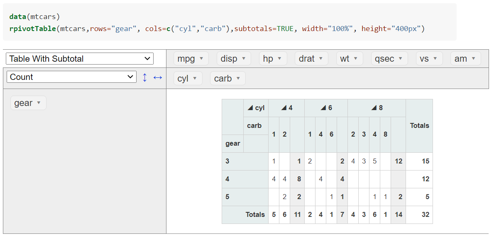
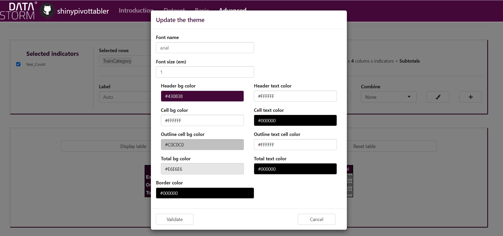

# shinypivottabler

Dans la famille des packages **shiny** chez **Datastorm**, je demande maintenant la grande sœur, à savoir **shinypivottabler**, qui propose un module **shiny** permettant aux utilisateurs de construire, visualiser, et télécharger le tableau croisé de leurs rêves (rien que ça...!)

Il est basé sur le package **pivottabler** (http://www.pivottabler.org.uk/), en amenant une surcouche pour son intégration et son utilisation en *clique-bouton* depuis une application **shiny**.

### shinypivottabler vs rpivotTable ?

Le package **rpivotTable** (https://github.com/smartinsightsfromdata/rpivotTable) permet déjà de construire un tableau croisé *via* une application **shiny** en proposant un *wrapper* autour de la librairie *javascript* **PivotTable.js**. Le tout avec des fonctionnalités plutôt sympathiques comme : 

- la définition de notre table en *drag'n'drop*
- la mise à disposition de nombreuses fonctions d'agrégation
- la possibilité de visualiser la table et les graphiques intéractifs correspondants



Cependant, avec l'utilisation d'une librairie *javascript*, toutes les données sont envoyées côté client, c'est à dire à la page web, et les calculs y sont également effectués. Quand on souhaite traiter un gros volume de données, ce n'est donc pas forcément l'outil le plus adapté car on risque de surcharger le navigateur et l'ordinateur de l'utilisateur.

Avec **rpivotTable**, et donc **shinypivottabler**, les données et les calculs restent côté serveur, ce qui permet de traiter des tables plus volumineuses, et cela sans mettre à mal les ressources de nos utilisateurs, avec en bonus quelques fonctionnalités intéressantes : 

- la définition de nouvelles fonctions d'agrégation
- le calcul d'indicateurs combinés
- la customisation de la table générée et son exportation directement en **excel**


### Installation

Le package est actuellement en phase de test et de validation. Il devrait donc arriver dans les prochaines semaines sur le **CRAN**. En attendant, vous pouvez l'installer directement depuis notre github https://github.com/datastorm-open : 

``` r
if(!require(devtools)) install.packages("devtools")
devtools::install_github("datastorm-open/shinypivottabler")
```

### Application de démonstration

Une application de démonstration est disponible 

- directement dans le package : 

``` r
runApp(system.file("demo_app", package = "shinypivottabler"))
```

- en ligne à l'adresse suivante : https://datastorm-demo.shinyapps.io/shinypivottabler/

- et dans la vidéo ci-dessous

### Utilisation

Le package se compose uniquement de deux fonctions définissant le module à insérer dans votre application **shiny** : 

- ``shinypivottablerUI`` : dans le script *ui.R*, avec l'identifiant du module à renseigner, et optionnellement deux paramètres permettant de définir les couleurs et la largeur des traits de l'interface utilisateur
- ``shinypivottabler`` : dans la partie du *server.R* avec à minima :
    + l'identifiant du module (id)
    + ainsi que les données sur lesquels on souhaite construire des tableaux croisés (data)
    
``` r
# minimal example
require(shinypivottabler)
require(shiny)

# create artificial dataset
n <- 1000000
data <- data.frame("gr1" = sample(c("A", "B", "C", "D"), size = n,
                                 prob = rep(1, 4), replace = T),
                   "gr2" = sample(c("E", "F", "G", "H"), size = n,
                                 prob = rep(1, 4), replace = T),
                   "value1" = 1:n,
                   "value2" = n:1)

ui = shiny::fluidPage(
  shinypivottablerUI(id = "id")
)

server = function(input, output, session) {
  shiny::callModule(module = shinypivottabler,
                    id = "id",
                    data = data)
}

shiny::shinyApp(ui = ui, server = server)
```

#### Charte graphique

En complément de la paramétrisation possible des deux couleurs et de la largeur des traits de l'interface utilisateur dans ``shinypivottablerUI``, vous pouvez modifier le thème présent par défaut pour le tableau croisé avec l'argument ``theme``. Et dans tous les cas, l'utilisateur pourra modifier l'ensemble de ces options depuis le module avec le bouton ``Update theme``.

``` r
# new default theme
theme <- list(
  fontName="arial",
  fontSize="1em",
  headerBackgroundColor = "#430838",
  headerColor = "rgb(255, 255, 255)",
  cellBackgroundColor = "rgb(255, 255, 255)",
  cellColor = "rgb(0, 0, 0)",
  outlineCellBackgroundColor = "rgb(192, 192, 192)",
  outlineCellColor = "rgb(0, 0, 0)",
  totalBackgroundColor = "#e6e6e6",
  totalColor = "rgb(0, 0, 0)",
  borderColor = "#000000"
)

# ui
ui = shiny::fluidPage(
  shinypivottablerUI(id = "id", 
    app_colors = c("#e6e6e6", "#430838"),
    app_linewidth = 3
  )
)

# server
server = function(input, output, session) {
  shiny::callModule(module = shinypivottabler,
                    id = "id",
                    show_title = FALSE,
                    theme = theme,
                    data = data)
}
```




#### Définition de nouveaux indicateurs

Par défaut,  les fonctions suivantes sont disponibles dans le module :  ``Sum``, ``Mean``, ``Min``, ``Max``, ``Standard Deviation``, ``Count`` et ``Count Distinct`` pour les variables quantitavies, et seulement ``Count`` et ``Count Distinct`` pour les variables qualitatives. Et l'interface permet de combiner deux indicateurs (``+``, ``-``, ``*``, et ``/``).

Vous pouvez si vous le souhaitez définir des nouvelles fonctions d'agrégation avec les arguments ``additional_expr_num`` (quantitative), ``additional_expr_char`` (qualitative) & ``additional_combine``.

``` r
additional_expr_num = list(
  "Median" = "paste0('median(', target, ', na.rm = TRUE)')"
)

getmode <- function(v) {
   uniqv <- unique(v)
   uniqv[which.max(tabulate(match(v, uniqv)))]
}

additional_expr_char = list(
"Mode" = "paste0('getmode(', target, ')')"
)

additional_combine = c("Modulo" = "%%")

# ui
# server
server = function(input, output, session) {
  shiny::callModule(module = shinypivottabler,
                    id = "id",
                    additional_expr_num = additional_expr_num,
                    additional_expr_char = additional_expr_char,
                    additional_combine = additional_combine,
                    data = data)
}
````

### Next steps

Plusieurs axes d'améliorations sont déjà dans notre *TO DO* : 

- pouvoir sauvegarder et recharger une définition d'un tableau croisé
- proposer des fonctionnalités graphiques
- permettre l'affichage de nos indicateurs en %
